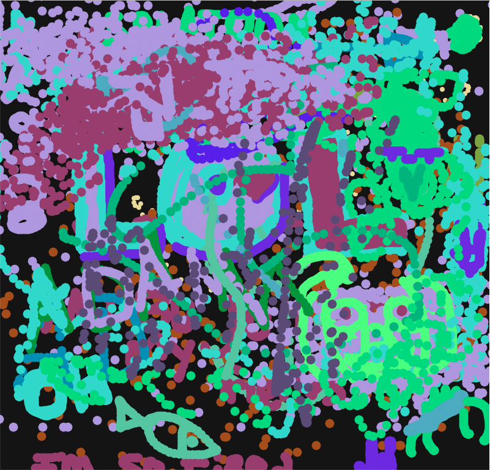
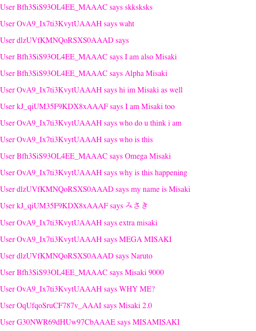
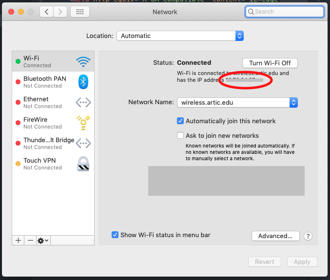

# Server w/ Node.js, Express & Socket.io

Simple drawing app for other students at SAIC to join / collaborate!

## Our current state (of the Art)

   
This is what happened after letting students for 15 minutes.

## Running the server
In order to host the server, please type:
```bash
node server.js
```

## Finding the IP address to join:
Anyone who host the server need to share the IP Address:


**Important** - Since this is created for SAIC Students, it seems to be only working for SAIC wifi network. Need to check if it works in other wifi networks as well.
